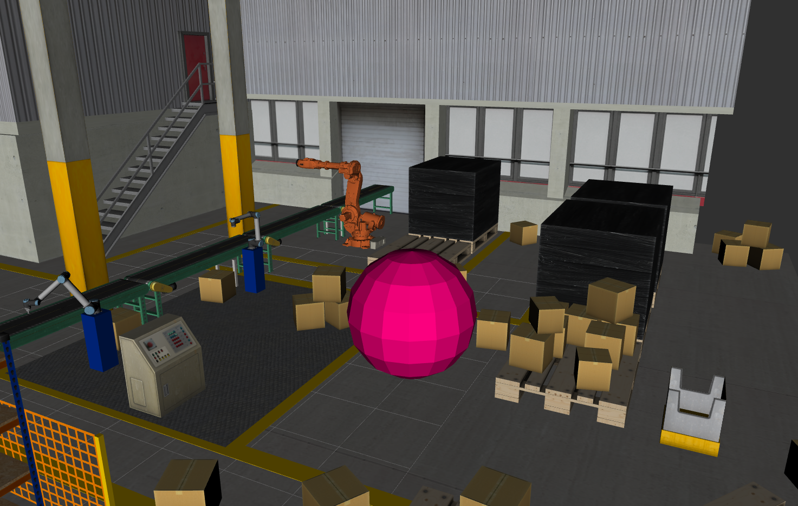

# Lecture 1 Documentation

[Lecture 1 slides](OMTP_LEC_1_BUILD_A_ROBOT_SIMULATION_ENVIRONMENT.pdf)

## Project Details: 

### 1. URDF tutorials

The tutorials [Building a Visual Robot Model with URDF from Scratch](http://wiki.ros.org/urdf/Tutorials/Building%20a%20Visual%20Robot%20Model%20with%20URDF%20from%20Scratch) and [Building a Movable Robot Model with URDF](http://wiki.ros.org/urdf/Tutorials/Building%20a%20Movable%20Robot%20Model%20with%20URDFhttp://wiki.ros.org/urdf/Tutorials/Building%20a%20Movable%20Robot%20Model%20with%20URDF) are applied [here](urdf_tutorial/urdf).

### 2. Xacro tutorials

The tutorial [Using Xacro to Clean Up a URDF File](http://wiki.ros.org/urdf/Tutorials/Using%20Xacro%20to%20Clean%20Up%20a%20URDF%20Filehttp://wiki.ros.org/urdf/Tutorials/Using%20Xacro%20to%20Clean%20Up%20a%20URDF%20File) is applied in [this file](urdf_tutorial/urdf/08-macroed.urdf.xacro)

### 3.-6. Factory
The edited launch file can be found [here](omtp_support/urdf/omtp_factory_assignment.xacro)

## Instructions: 
* To see the urdf files generated in assignments 1 and 2, use the command `roslaunch urdf_tutorial display.launch {file_name}.urdf`
* To see the factory created in assignments 3 to 6, use the command `roslaunch omtp_support visualize_omtp_factory.launch`

## Ideas for Future Work: 
The submission has concrete future ideas for improving the project

