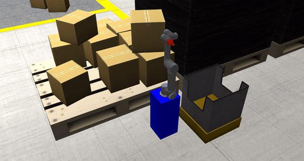

# Lecture 5: moveit intro

All the assignments were follwing the instructions in the lecture [slides](OMTP_LEC_5_MANIPULATION_WITH_MOVEIT.pdf).

## Dependencies

```bash
sudo apt-get install ros-melodic-moveit ros-melodic-moveit-commander ros-melodic-joint-trajectory-controller ros-melodic-trac-ik-kinematics-plugin ros-melodic-ros-control ros-melodic-gazebo-ros-control
```

## Assignment 1

Created moveit configuration for the factory environment from lecture 1.
This was done by using the moveit configuration assistant. The result is the ros package in [here](omtp_moveit_config/package.xml).

## Assignment 2

A moveit commander script was used to create a simple movement sequence for one of the robot arms in the factory environment. The script is [here](scripts/lecture5_assignment2_script).

## Assignment 3

A python script that creates a ROS node that commands the gazebo environment of the factory with the moveit configuration from assignment 1. This script creates an approximation of a pick and place task as it can be seen in the gif below. The python script can be found [here](scripts/lecture5_assignment3.py).


