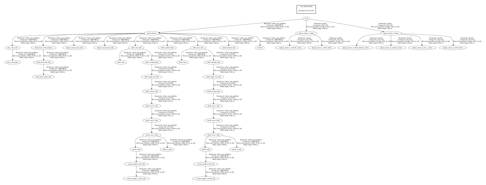

# Lecture 6 object detection and grasping

All the assignments were completed following the instructions in the lecture [slides](OMTP_LEC_6_OBJECT_DETECTION_AND_GRASPING.pdf).

## Assignment 1a
Included two logical cameras into gazebo environment lecture6_assignment1.world. 

## Assignment 1b
The two logical cameras were configured with Link name and Sensor name.

## Assignment 2
The simulation was run with the two cameras and tf tree was extracted as a pdf.

## Assignment 3
An object was spawned near Robot2, the observed coordinates for the object are transformed into world frame. The code can be found [here](scripts/lecture6_assignment3.py).

## Assignment 4
A python script is written to pick up the spawned object and drop it in the nearest bin. The script was written for Robot2. The code can be found [here](scripts/lecture6_assignment4.py).