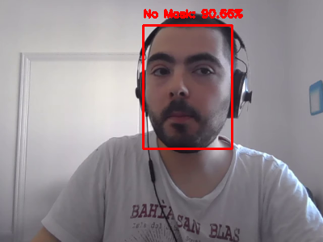
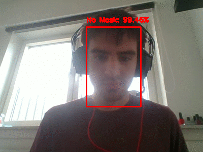
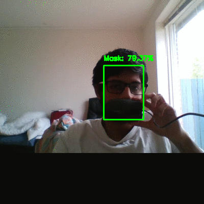

# Lecture 8 Advanced Topic 1 - CNNs in Practical Robotic Applications
The assignment was completed using Google Colab and the accompanying code provided by the course lecturers.

## Assignment 1
Guillermo's Result:

Kristian's Result:

Ander's Result:

Beda's Result:

Iñigo's Result:

Sarvesh' Result:

