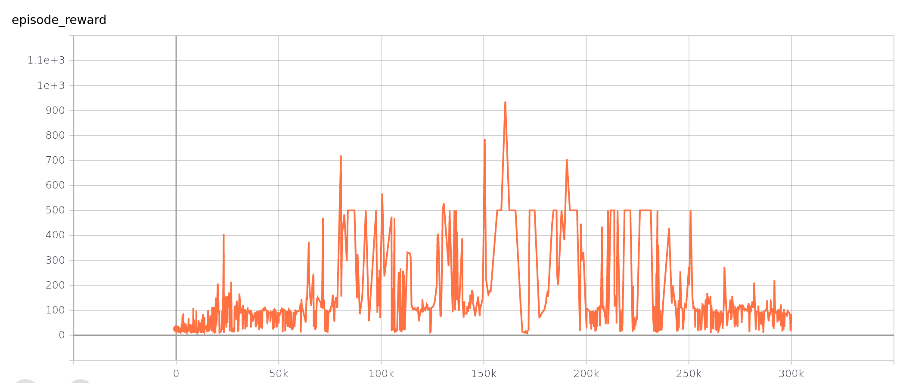
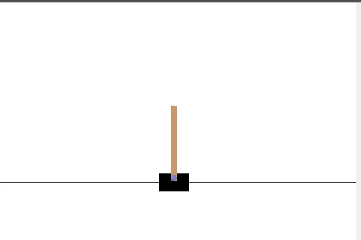

# Lecture 9 Advanced Topic 2 - Reinforcement learning
The method which was followed to complete the assignment can be seen [here](OMTP_LEC_9_ADV_TOPIC_REINFORCEMENT_LEARNING.pdf). 

OpenAI Gym was used to obtain the setup of the environment. DQN is the algorithm that was used to train the neural network. The method was evaluated using TensorBoard. 

